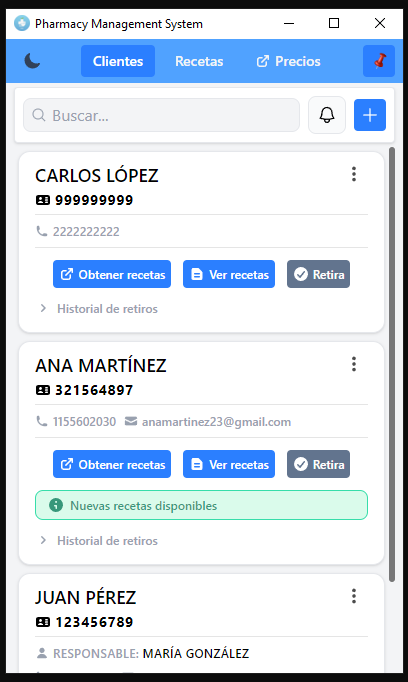
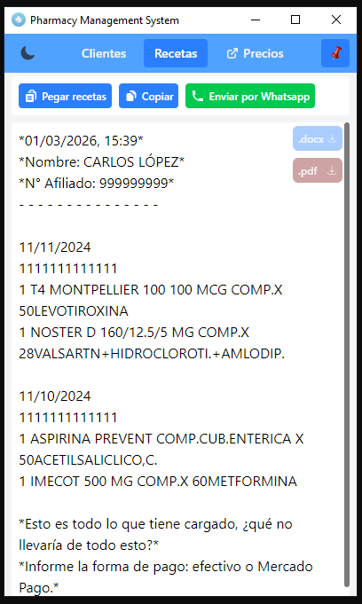
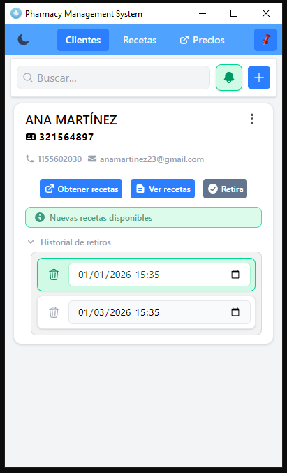
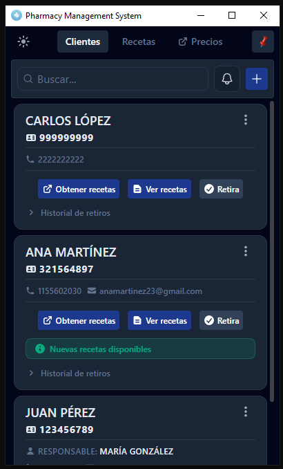

# Pharmacy Management System

Una solución de escritorio diseñada para optimizar la gestión de clientes y el procesamiento de recetas médicas, reduciendo tiempos manuales y garantizando una comunicación profesional.

## Problema que Resuelve
En farmacias que trabajan con sistemas de autorización como IMED, gran parte del flujo diario implica:
- Búsqueda manual de afiliados
- Copiado repetitivo de datos
- Envío de recetas en formatos informales o poco claros
- Seguimiento informal de retiros
- Comunicación poco estandarizada con pacientes

Esto genera pérdida de tiempo, errores evitables y una experiencia poco profesional.
El sistema centraliza y automatiza este flujo en una única herramienta de escritorio.

## 📸 Capturas de Pantalla
### Vista Principal

  

### Procesador de Recetas

  

### Sistema de Alertas

  

### Dark Mode

  

## Características Principales

### 📋 Gestión de Afiliados
Administración completa (CRUD) de la base de datos de clientes, permitiendo búsquedas rápidas por nombre, número de afiliado o persona responsable.

### 🌐 Integración con IMED
Acceso directo al portal de autorizaciones (IMED) con copiado automático del número de afiliado en el portapapeles, agilizando el flujo de trabajo entre la aplicación y el sitio web externo.

### ✍️ Procesador Inteligente de Recetas
Motor de procesamiento que transforma texto desestructurado en listas de medicación organizadas y legibles, listas para ser enviadas o documentadas.

### 🔔 Control de Retiros y Alertas
Sistema de registro sistemático de entregas de medicación. Incluye alertas visuales automáticas cuando un cliente lleva más de 30 días sin realizar un retiro, facilitando el seguimiento preventivo de nuevas recetas disponibles.

### 📲 Comunicación Directa
Integración fluida con WhatsApp para el envío de recetas formateadas profesionalmente, mejorando la experiencia y claridad para los pacientes.

### 💻 Interfaz y Productividad
*   **Modo Siempre Visible:** Opción de mantener la ventana al frente para trabajar en paralelo con otras herramientas.
*   **Diseño Moderno:** Interfaz responsiva con Modo Oscuro nativo para reducir la fatiga visual.

---

## Stack Tecnológico
*   **Core:** Electron
*   **Frontend:** React + TypeScript
*   **Base de Datos:** SQLite
*   **Estilos:** Tailwind CSS

## Instalación y Desarrollo
1.  Clona el repositorio: `git clone https://github.com/nicoard12/Pharmacy-Management-System.git`
2.  Instala las dependencias: `npm install`
3.  Inicia la aplicación: `npm run dev`

---
*Desarrollado para ofrecer eficiencia y precisión en el entorno farmacéutico.*
